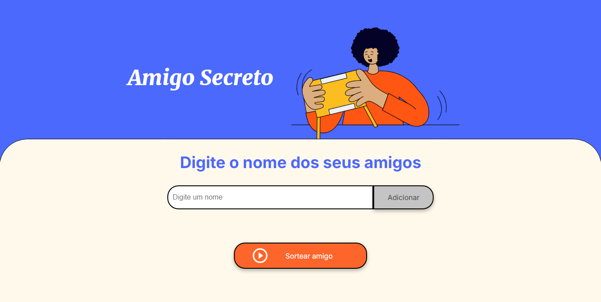
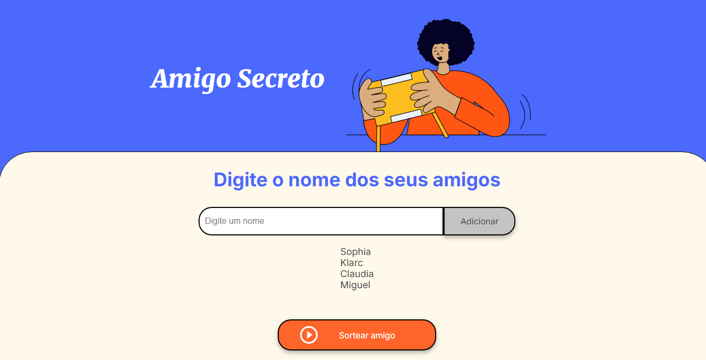
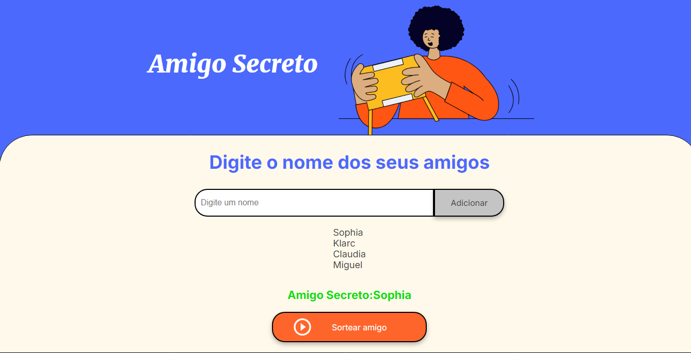

# Amigo Secreto

## Descrição
Aplicação web simples para realizar sorteios de amigo secreto.

## Tecnologias Utilizadas
* HTML
* CSS
* JavaScript

## Instalação
Clone este repositório e abra o arquivo `index.html` em seu navegador.

## Funcionamento
1. **Adicionar nomes:** Digite o nome do participante no campo de texto e clique no botão "Adicionar".
2. **Realizar sorteio:** Clique no botão "Sortear" para gerar os pares.
3. **Limpar lista:** Clique no botão "Limpar" para remover todos os nomes da lista.

## Funcionalidades
* Adicionar e remover participantes
* Sorteio aleatório
* Exibição dos resultados em uma lista

## Exemplos

